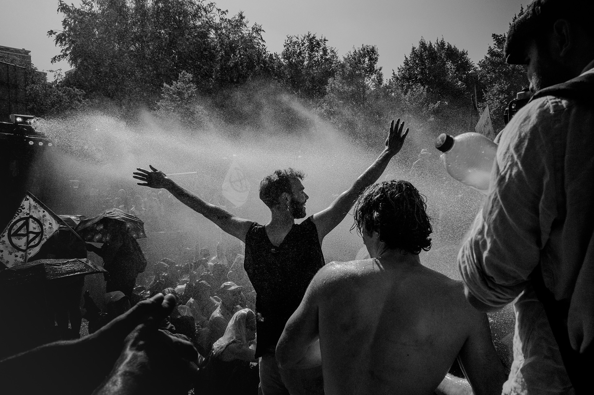

---
tags:
  - Location
location:
  - 52.085647317430535, 4.324183613061906
pubDate: April 08 2026 
updatedDate: April 11 2026
createdDate: March 25 2024
title: Optimism and Defiance
img: /favicon-32x32.png

---

9 September 2023 – the 8th A12 blockade: Optimism and defiance.

More than 2,400 arrests were made.

According to Extinction Rebellion, around 25,000 people demonstrated on and alongside the A12, both in the blockade and at the support demonstration.
The so‑called support demonstration took place on the Laan van Reagan en Gorbatsjov and was organized by a coalition of organizations including Greenpeace and Milieudefensie.

The police did not publish an estimate. By around 18:30 all demonstrators had been removed from the road. During the clearing of the A12, the water cannons were reportedly used with a harder jet than in previous A12 blockades.

This photo was taken just before the charges were carried out. There was a kind of magic in the air that entire day, as if the day would never end.

Nothing could have been further from the truth.