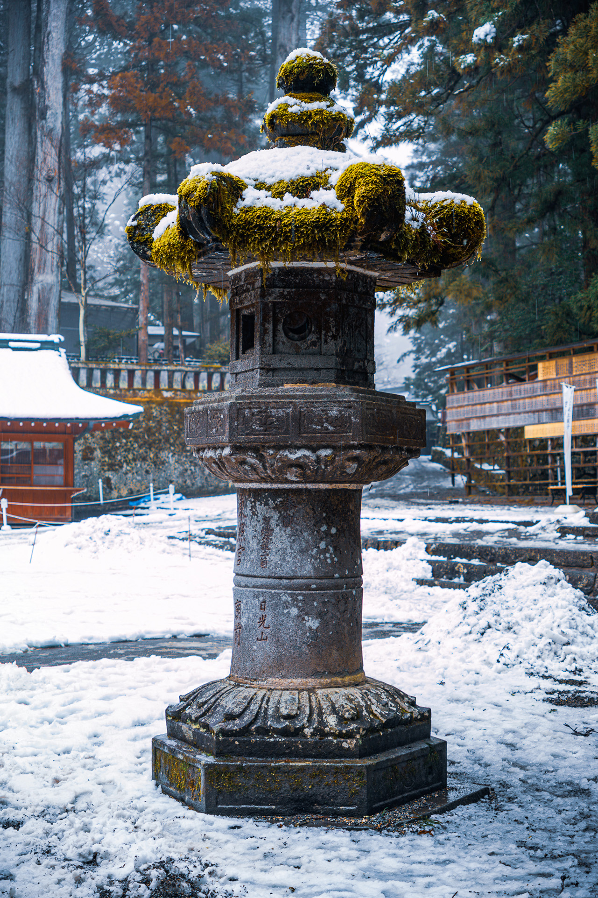

---
tags:
  - Location
location:
  - 36.75780849360269, 139.5987804058543
pubDate: April 08 2026 
title: Lantern in Nikko
img: /favicon-32x32.png

---

**March 25,2024 Lantern in Nikko**

Taken in Nikko, I do like the fairytale‑like atmosphere. Not particularly special by definition. ¯\(ツ)/¯

Nikko (Japanese: 日光市, Nikkō‑shi) is a city in Japan’s Tochigi Prefecture, in the northern part of the Kantō region. The city lies on the eastern flank of a mountain range, 25 kilometers northwest of Utsunomiya and 115 kilometers north of Tokyo. Nikko is a tourist attraction and a place of great historical significance. Points of interest include the mausoleums of shogun Tokugawa Ieyasu and his grandson Iemitsu, the Futarasan Shrine, and the Buddhist temple Rinnoji. West of Nikko lies the national park of the same name, as well as several popular onsen. The temple complexes of Nikko are recognized as a UNESCO World Heritage Site.

Source: https://nl.wikipedia.org/wiki/Nikko